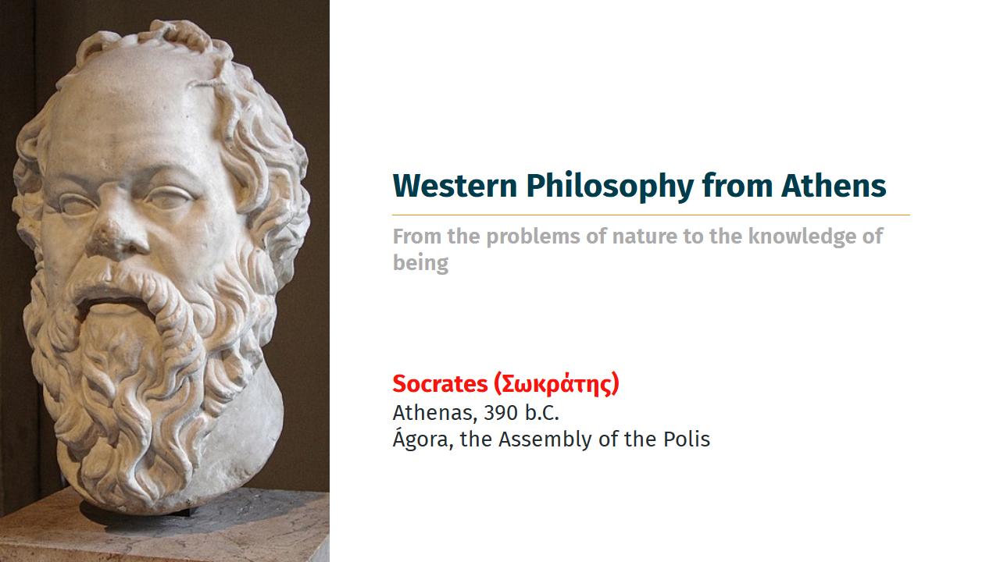

# MarpX (work in progress!)

Marp themes still created with beauty and simplicity in mind.
This is Marp Style 2.0

> **MarpX** — Beautiful, semantic, and powerful themes for Marp presentations.
> MarpX is the result of an effort to expand, redesign, optimize and improve my first Marp slide theme composition initiative [Marpstyle](https://github.com/cunhapaulo/marpstyle). One may say MarpX is Marpstyle 2.0.


<small>Shaun The Sheep - Copyright ©️ 2025 aardman animations ltd.</small>

## Overview

**MarpX** is a comprehensive suite of advanced, visually appealing, and highly customizable themes and utilities for [Marp](https://marp.app/), the Markdown presentation ecosystem.  
Designed for educators, researchers, and professionals, MarpX enables the creation of visually stunning, semantically rich, and accessible presentations with minimal effort.

## 💡 Interesting new features

### **Different title slides**:

| Usual style                                                                                                                        | Academic style                                                                                                                     |
| ---------------------------------------------------------------------------------------------------------------------------------- | ---------------------------------------------------------------------------------------------------------------------------------- |
|  |  |

### New alignment possibilities:

| **Autonumbering** captions                                                                                                         | **Vertical-center alignment**                                                                                                       |
| ---------------------------------------------------------------------------------------------------------------------------------- | ----------------------------------------------------------------------------------------------------------------------------------- |
|  |  |

### Dark mode for **quote slides** (`<!-- _class: quote dark -->`):

| Normal mode quote                                                                                                                  | Dark mode quote                                                                                                                    |
| ---------------------------------------------------------------------------------------------------------------------------------- | ---------------------------------------------------------------------------------------------------------------------------------- |
|  |  |

---

## 🚀 Key Features

- **Multiple Slide Types:** Effortlessly create title, chapter, agenda, references, quotes, end/thank you, and other specialized slides.
- **Semantic Slide Classes:** Use intuitive Markdown comments (e.g., `<!-- _class: chapter -->`) to switch slide layouts and styles.
- **Multi-Column Layouts:** Easily build slides with flexible columns and grid-based layouts.
- **Advanced Table Styling:** Enjoy beautiful, readable tables with zebra striping, hover effects, and responsive design.
- **Custom Quotes:** Unified quote system with alternative styles (e.g., `quote dark`) for emphasis and variety.
- **References Section:** Dedicated formatting for bibliographies and reference slides, supporting academic standards.
- **Branding Support:** Seamlessly add logos, copyright, and custom footers.
- **Responsive and Scalable:** Optimized for FullHD, 16:9, and 4:3 aspect ratios.
- **Google Fonts Integration:** Modern, readable font choices for every context.
- **Accessible Colors:** Carefully curated palette for clarity, contrast, and accessibility.
- **Easy Customization:** Modify variables and classes to match your institution or personal style.

---

# Available MARPX Themes

Here you´ll find examples of the available themes. Click on the picture to open a corresponding PDF example.

| In honor of Σωκράτης - Socrates (469–399 B.C.E.)                                        |
| :-------------------------------------------------------------------------------------- |
| [](./examples/pdfs/socrates.pdf) |

---

## 📦 Getting Started

1. **Clone or Download** this repository.
2. **Copy** the desired theme(s) and CSS files to your Marp project directory.
3. **Reference** the theme in your Markdown frontmatter:
   ```json
   ---
   title: Western Philosophy from Athens
   author: Socarates
   size: 16:9
   lang: en-US
   math: mathjax
   marp: true
   theme: socrates
   ---
   ```
4. **Create** a front slide like this:
   ```html
   ---
    <!-- _class: title academic -->
    <!-- _backgroundColor: white  -->

     
       
     <div class="title">        Western Philosophy from Athens </div>
     <div class="subtitle">     From nature to the being </div> 
     <div class="author">       Socrates (Σωκράτης) </div>
     <div class="date">         Athenas, 390 b.C.</div>
     <div class="organization"> Ágora, the Assembly of the Polis</div>
    ---
   ```
5. **Use semantic classes** in your slides to unlock advanced layouts:

   ```html
   ---

   <!-- _class: chapter -->

   # Chapter Title

   ---
   
   <!-- _class: quote dark -->

   > "A beautiful quote."
   
   ---
   ```

6. **Export** your presentation using Marp CLI, VS Code extension, or Marp web tools.

---

## 🛠️ Customization

- **Theme Variables:**  
  Tweak colors, fonts, and layout variables in the CSS to match your branding or preferences.
- **Slide Classes:**  
  Combine multiple classes (e.g., `<!-- _class: quote alt -->`) for even more control.
- **Extend:**  
  Fork or extend MarpX to create your own variants and share with the community.

---

## 🙏 Credits

- Inspired by the [Marp](https://marp.app/) project and its contributors.
- Inspired by the work of [marp-template-hsmw](https://git.hs-mittweida.de/marp/marp-template-hsmw). Herzlichen Dank!
- Uses [Google Fonts](https://fonts.google.com/) for typography.
- Thanks to the open-source community for feedback, inspiration, and contributions.
- Special thanks to all educators, researchers, and professionals who value clarity and beauty in their presentations.

---

## 👤 Authorship

**MarpX** is authored and maintained by [Paulo Cunha](https://github.com/cunhapaulo), 2025.

For questions, suggestions, or contributions, please open an issue or pull request on GitHub.

---

## 📄 License

This project is licensed under the MIT License. See [LICENSE](LICENSE) for details.
