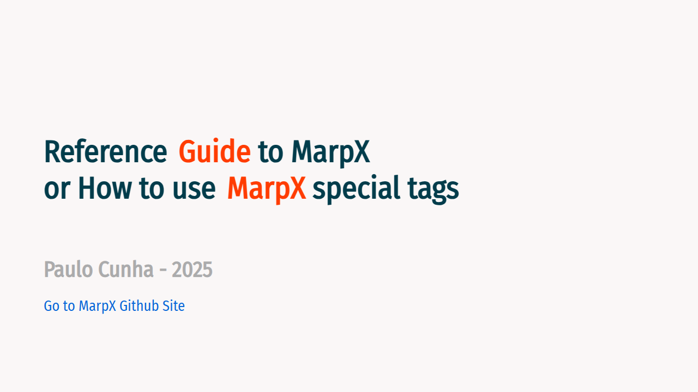
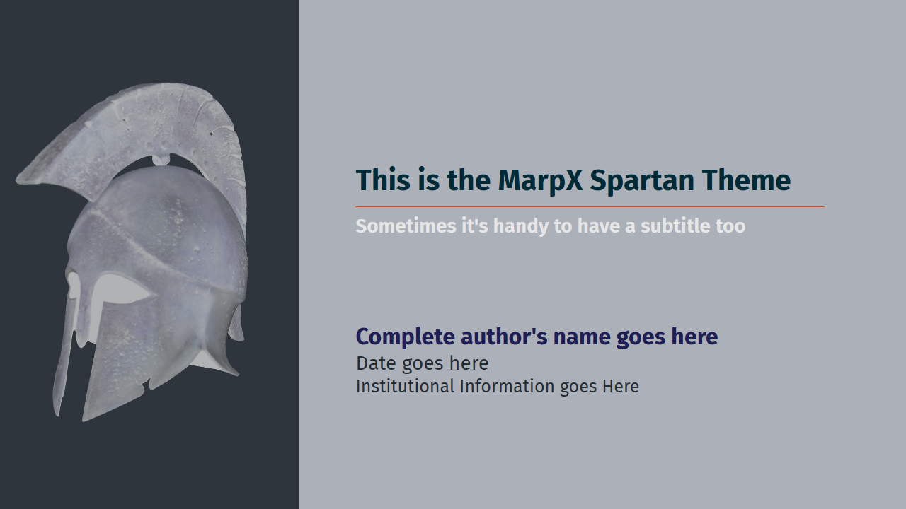
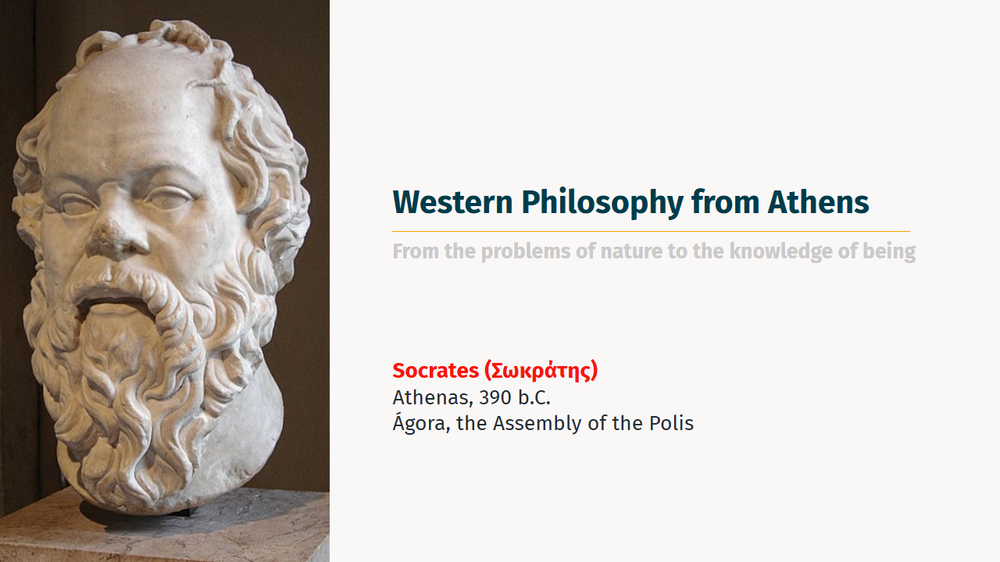
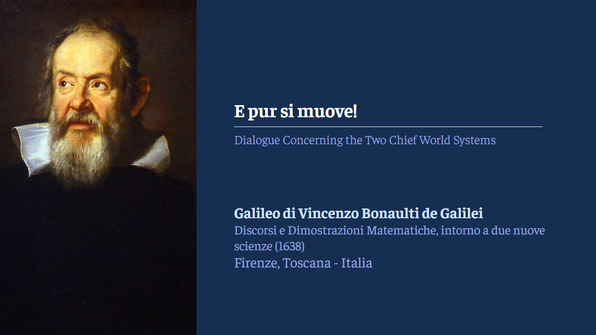

# MarpX (is a work in progress!)

Marp themes still created with beauty and simplicity in mind.
This is Marp Style 2.0

> **MarpX** — Beautiful, semantic, and powerful themes for Marp presentations.
> MarpX is the result of an effort to expand, redesign, optimize and improve my first Marp slide theme composition initiative [Marpstyle](https://github.com/cunhapaulo/marpstyle). One may say MarpX is Marpstyle 2.0.

## Overview

**MarpX** is a comprehensive suite of advanced, visually appealing, and highly customizable themes and utilities for [Marp](https://marp.app/), the Markdown presentation ecosystem.  
Designed for educators, researchers, and professionals, MarpX enables the creation of visually stunning, semantically rich, and accessible presentations with minimal effort.

## A very basic YAML header:
```yaml
---
title: How to use MarpX Special Tags
author: Paulo Cunha
description: Canonical use of marpx theme
keywords: [Marp, MarpX, Gödel, Paulo Cunha]

header: 
footer: "[`Back to Contents`](#2)"

marp: true
theme: gödel
paginate: true
transition: none

size: 16:9
lang: en
math: mathjax
---
```

## Key Features in Tags (in alphabetic order)

| Item                                                                               | Marcador                                                         |
| ---------------------------------------------------------------------------------- | ---------------------------------------------------------------- |
| [Boxes](https://cunhapaulo.github.io/marpx/examples/howto.html#12)                 | `<box></box>` or `<span class="box"></span>`                     |
| [Black or White Slides](https://cunhapaulo.github.io/marpx/examples/howto.html#32) | `<!-- _class: black-slide -->` or `<!-- _class: white-slide -->` |
| [Callouts](https://cunhapaulo.github.io/marpx/examples/howto.html#28)              | `<div class="callout"></div>`                                    |
| [Multicolumn](https://cunhapaulo.github.io/marpx/examples/howto.html#16)           | `<div class="multicolumn" align="center"></div>`                 |
| [Notes](https://cunhapaulo.github.io/marpx/examples/howto.html#34)                 | `<div class=notes></div>`                                        |
| [Quotes](https://cunhapaulo.github.io/marpx/examples/howto.html#26)                | `<!-- _class: quote -->` or `<!-- _class: quote dark -->`        |
| [References](https://cunhapaulo.github.io/marpx/examples/howto.html#30)            | `<!-- _class: references -->`                                    |
| [Title](https://cunhapaulo.github.io/marpx/examples/howto.html#4)                  | `<!-- _class: title -->` or `<!-- _class: title-academic -->`    |
| [TOC](https://cunhapaulo.github.io/marpx/examples/howto.html#8)                    | `<!-- _class: toc -->`                                           |
| [Transition Slide](https://cunhapaulo.github.io/marpx/examples/howto.html#10)      | `<!-- _class: chapter -->`                                       |
| [Videos](https://cunhapaulo.github.io/marpx/examples/howto.html#18)                | `<video controls height="400px"></video>`                        |


## References (IMPORTANT!)

Try the Reference Guide that shows most of the special canonical slide types in Marpx!

[](https://cunhapaulo.github.io/marpx/examples/howto.html)


## 🚀 Key Features

- **Multiple Slide Types:** Effortlessly create title, chapter, agenda, references, quotes, end/thank you, and other specialized slides.
- **Semantic Slide Classes:** Use intuitive Markdown comments (e.g., `<!-- _class: chapter -->`) to switch slide layouts and styles.
- **Multi-Column Layouts:** Easily build slides with flexible columns and grid-based layouts.
- **Advanced Table Styling:** Enjoy beautiful, readable tables with zebra striping, hover effects, and responsive design.
- **Custom Quotes:** Unified quote system with alternative styles (e.g., `quote dark`) for emphasis and variety.
- **References Section:** Dedicated formatting for bibliographies and reference slides, supporting academic standards.
- **Branding Support:** Seamlessly add logos, copyright, and custom footers.
- **Responsive and Scalable:** Optimized for FullHD, 16:9, and 4:3 aspect ratios.
- **Google Fonts Integration:** Modern, readable font choices for every context.
- **Accessible Colors:** Carefully curated palette for clarity, contrast, and accessibility.
- **Easy Customization:** Modify variables and classes to match your institution or personal style.

# Available MARPX Themes

Here you´ll find examples of the available themes. Click on the picture to open a corresponding PDF example.
|                                                                                                                        |
| :--------------------------------------------------------------------------------------------------------------------- |
| <h3> **sparta** - In honor of Sparta from Greece </h3>                                                                            |
| [](https://cunhapaulo.github.io/marpx/examples/sparta.html)       |
| <h3> **socrates** - In honor of Σωκράτης - Socrates (469–399 B.C.E.) </h3>                                                            |
| [](https://cunhapaulo.github.io/marpx/examples/socrates.html)     |
| <h3> **copernicus** - In honor of Niklas Koppernigk - Nicolaus Copernicus (1473–1543) </h3>                                             |
| [](https://cunhapaulo.github.io/marpx/examples/copernicus.html) |
| <h3> **Galileo** - In honor of Galileu Galilei (1564–1642) </h3>                                             |
| [](https://cunhapaulo.github.io/marpx/examples/galileo.html) |
| <h3> **newton** - In honor of Sir Isaac Newton (1642 - 1727) </h3>                                                            |
| [](https://cunhapaulo.github.io/marpx/examples/newton.html)     |
| <h3> **einstein** - In honor of Albert Einstein (1879–1955) </h3>                                             |
| [](https://cunhapaulo.github.io/marpx/examples/einstein.html) |
| <h3> **gropius** - In honor of Walter Gropius (1883-1969) </h3>                                             |
| [](https://cunhapaulo.github.io/marpx/examples/gropius.html) |
| <h3> **gödel** - In honor of Kurt Gödel (1906-1978) </h3>                                             |
| [](https://cunhapaulo.github.io/marpx/examples/gödel.html) |


## 📦 Getting Started

### 1. Config your environment to use MarpX themes

1. In case you want to install the theme files locally, for possible use without internet access, proceed as follow:
   - **Clone or Download** this repository, specially the the files in the `themes` directory (folder), to your local drive, in a very well know directory (folder);
   - When using `VScode`, configure the code-workspace file to indicate exactly where the theme files are. Remember that there is always the possibility of these theme files being downloaded from the Internet:

    Example of a locally stored theme `code-workspace` config file:

   ```json
   {
     "folders": [
       {
         "path": "."
       }
     ],
     "settings": {
       "markdown.marp.themes": [
         "./themes/marpx.css",
         "./themes/copernicus.css",
         "./themes/einstein.css",
         "./themes/frankfurt.css",
         "./themes/gödel.css",
         "./themes/gropius.css",
         "./themes/newton.css",
         "./themes/socrates.css",
         "./themes/sparta.css"
       ]
     }
   }
   ```
  1. In case you don´t want the burden of downloading anything and use the themes directly from the Internet, proceed as follows.
   
      - Config your VScode code-workspace config file to indicate exactly where the theme files are (Internet).
  
      Internet stored themes `code-workspace` config:
      
      ```json
      {
        "folders": [
          {
            "path": "."
          }
        ],
        "settings": {
          "markdown.marp.themes": [
            "https://cunhapaulo.github.io/marpx/themes/marpx.css",
            "https://cunhapaulo.github.io/marpx/themes/copernicus.css",
            "https://cunhapaulo.github.io/marpx/themes/einstein.css",
            "https://cunhapaulo.github.io/marpx/themes/frankfurt.css",
            "https://cunhapaulo.github.io/marpx/themes/gödel.css",
            "https://cunhapaulo.github.io/marpx/themes/gropius.css",
            "https://cunhapaulo.github.io/marpx/themes/newton.css",
            "https://cunhapaulo.github.io/marpx/themes/socrates.css",
            "https://cunhapaulo.github.io/marpx/themes/sparta.css"
          ]
        }
      }
      ```

### 2. **Reference** one of the available themes in your slide deck in Markdown:
  Once you've configured the location of the theme files, the next step is to create your slidedeck.

  The first thing to do in your file is to create the header section in YAML:
   
   ```markdown
   ---
   title: Western Philosophy from Athens
   author: Socarates
   size: 16:9
   lang: en-US
   math: mathjax
   marp: true
   theme: socrates
   ---
   ```
### 3. **Create** a Title slide like this:

   ```html
   ---
   <!-- _class: title-academic -->
   <!-- _backgroundColor: white  -->
   
   
   
   <div class="title">Western Philosophy from Athens</div>
   <div class="subtitle">From nature to the being</div>
   <div class="author">Socrates (Σωκράτης)</div>
   <div class="date">Athenas, 390 b.C.</div>
   <div class="organization">Ágora, the Assembly of the Polis</div>
   ---
   ```
### 4. **Use semantic classes** in your slides to unlock advanced layouts:

   ```html
   ---
   <!-- _class: chapter -->
   # Chapter Title
   ---

   <!-- _class: quote dark -->

   > "A beautiful quote." ---
   ```

### 5. **Export** your presentation using Marp CLI, VS Code extension, or Marp web tools.

When all has been said and done, export your slide-deck to one of the available formats (PDF, HTML, PowerPoint, PNG, etc. )


## 🛠️ Customization

- **Theme Variables:**  
  Tweak colors, fonts, and layout variables in the CSS to match your branding or preferences.
- **Slide Classes:**  
  Combine multiple classes (e.g., `<!-- _class: quote dark -->`) for even more control.

## 💡 Interesting new features

### **Different title slides**:

| Usual style                                                                                                                        | Academic style                                                                                                                     |
| ---------------------------------------------------------------------------------------------------------------------------------- | ---------------------------------------------------------------------------------------------------------------------------------- |
|  |  |

### New alignment possibilities:

| **Autonumbering** captions                                                                                                         | **Vertical-center alignment**                                                                                                       |
| ---------------------------------------------------------------------------------------------------------------------------------- | ----------------------------------------------------------------------------------------------------------------------------------- |
|  |  |

### Dark mode for **quote slides** (`<!-- _class: quote dark -->`):

| Normal mode quote                                                                                                                  | Dark mode quote                                                                                                                    |
| ---------------------------------------------------------------------------------------------------------------------------------- | ---------------------------------------------------------------------------------------------------------------------------------- |
|  |  |


## 🙏 Credits

- Inspired by the [Marp](https://marp.app/) project and its contributors.
- Inspired by the work of [marp-template-hsmw](https://git.hs-mittweida.de/marp/marp-template-hsmw). Herzlichen Dank!
- Uses [Google Fonts](https://fonts.google.com/) for typography.
- Thanks to the open-source community for feedback, inspiration, and contributions.
- Special thanks to all educators, researchers, and professionals who value clarity and beauty in their presentations.


## 👤 Authorship

**MarpX** is authored and maintained by [Paulo Cunha](https://github.com/cunhapaulo), 2025.

For questions, suggestions, or contributions, please open an issue or pull request on GitHub.


## 📄 License

This project is licensed under the MIT License. See [LICENSE](LICENSE) for details.
