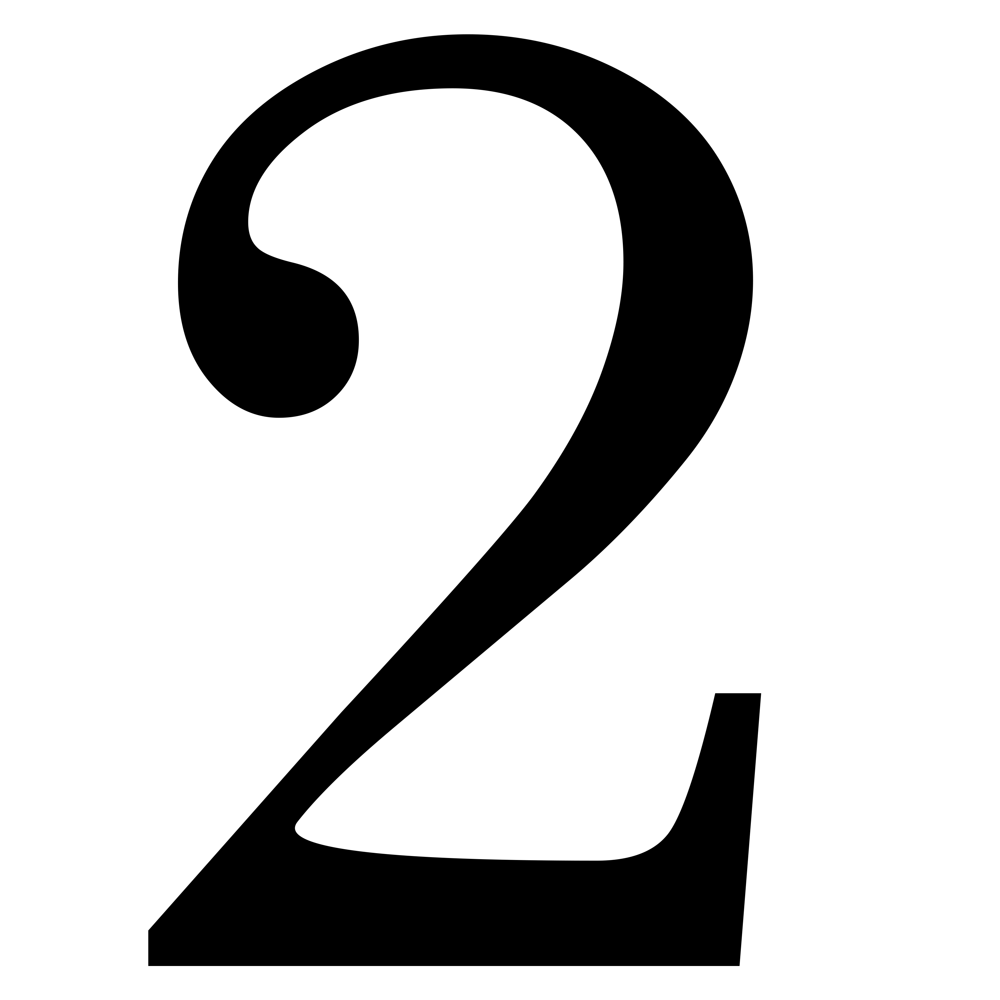

<!-- _class: title -->

#  Evento Comemorativo dos 160 anos de Publicação da Obra "O Céu e o Inferno"
## Capítulo VI - Criminosos Arrependidos

---

<!-- _class: chapter -->

# A Obra
## Sua estrutura e conteúdo

---
<!-- _class: blank -->

Obras da codificação kardequiana por ordem de publicação.

---

# A Obra - **O Céu e o Inferno** (1865)

- **Título original**: _"Le Ciel et l’enfer ou La Justice divine selon le spiritisme"_.
- **Sub-título**: "Exame comparado das doutrinas sobre a passagem da vida corporal à vida espiritual, sobre as _penalidades_ e _recompensas_ futuras, sobre os _anjos_ e _demônios_, sobre as _penas_ etc., seguido de numerosos _exemplos_ acerca da situação real da alma durante e depois da morte."
- **Temas Principais**:
  - Processo Desencarnatório e Imortalidade;
  - Consequência dos atos humanos;
  - Sistema de Justiça Divina;
  - Estado do ser após a morte (_do corpo físico_).
  
---

# Estrutura da Obra

### Primeira Parte: **DOUTRINA**
&nbsp;

   1. O Porvir e o nada;
   2. Temor da morte;
   3. O céu;
   4. O inferno;
   5. O Purgatório;
   6. Doutrina das penas eternas;

   7. As penas futuras segundo o Espiritísmo;
   8. Os anjos;
   9. Os demônios;
   10. Intervenção dos demônios nas modernas manifestações;
   11. É proibido evocar os mortos?
   

---

# Estrutura da Obra

### Segunda Parte: **EXEMPLOS**1
&nbsp;

   1. A Passagem;
   2. Espíritos Felizes;
   3. Espíritos em Condições Medianas;
   4. Espíritos Sofredores;

   5. Suicidas;
   6. `Criminosos Arrependidos`;
   7. Espíritos Endurecidos;
   8. Expiações Terrestres.

<footnote>

> 1 A ordem escolhida por <b>Kardec</b> para apresentar as classes de espíritos é inversa àquela da <b>Divina Comédia</b>.

</footnote>
   
---

<!-- _class: chapter -->

# Exemplos
## Capítulo VI - Criminosos Arrependidos

---

# **Verger**  &nbsp;<small> - Assassino do Arcebipo de Paris2</small>

- Em **03.jan.1857**, o arcebispo de Paris monsenhor **_Marie Auguste Dominique_ Sibour**&nbsp;(65) é mortalmente ferido pelo jovem padre **_Jean-Louis_ Verger** (30).
- Culpado, é **condenado** e **executado** em **30.jan.1857** do mesmo ano.
- Até o **último instante** náo demonstrou **pesar**, **arrependimento** ou **sensibilidade** pelo crime cometido.
- **Evocado** no mesmo dia da execução. Sua primeira frase **"Ainda estou preso ao corpo"** demonstra seu estado no mundo espiritual logo após sua execução.

<footnote>

> 2 Relato do ocorrido disponível (em francês): [https://www.telegram.fr](https://www.telerama.fr/sortir/dans-la-tete-des-criminels-de-paris-jean-louis-verger,-le-pretre-assassin,n6358822.php)

</footnote>

---

# **Verger**

1) Tinha **confusão mental** por ver o próprio **corpo** e sensações do **desencarne**;

2) Sentia medo pela represália daquele a quem havia prejudicado;
3) O medo o impedia de orar; 

`Evocado três dias depois...` 

4) Já tinha **consciência** completo do crime que cometeu, de que desencarnou, das múltiplas existências e da evolução;

---

# **Verger**

5) **Sofrimento** em decorrência do **remorso** pelo erro e pelo **caminho errado** que escolheu sem ouvir a própria **consciência**; 

6) Menciona o **prazer** em poder conversar com os encarnados e **vergonha** por ter sido **assassino**.

7) Verger foi **poupado** da visão do arcebispo por já apresentar **remorso** e o desejo de **reparar** seu crime. 
8) Mesmo antes de desencarnar e depois, já desencarnado, o arcebispo **Sibour** pede por **Verger** e não aparece para ele para poupá-lo.

---

# **Verger**

- ##### Responde a uma **questão** a respeito da fatalidade de ser um assassino, e se isso estava programado ao reencarnar.

- ##### Em **arrependimento**, expressa o desejo de reencarnar e experimentar o medo constate de vir a ser ssassinado.

- ##### A obstinação no mal, em vida, provém às vezes do orgulho, que recusa submeter-se e confessar os próprios erros, visto estar o homem sujeito à influência da matéria;

- ##### O **arrependimento** surgido com a desencarnação é sinal de um progresso moral realizado, que apenas aguarda uma circunstância favorável para se revelar.

---

<!-- _class: chapter -->

# Mensagens dos Espíritos
## Aspectos em comum entre as diversas mensagens

---

# Pontos em Comum

#### Pontos essenciais comuns nas mensagens dos espíritos no capítulo:
&nbsp;

*   **Sofrimento moral pós-morte**;
*   **Remorso pelas vítimas e crimes**;
*   **Descrença no "nada" desfeita**;
*   **Aceitação da justiça divina**;
*   **Arrependimento: início da reabilitação**;

*   **Alívio pela prece e auxílio espiritual**;
*   **Desejo de reparar e alertar**;
*   **Anseio pela reparação por meio da reencarnação**;
*   **Reafirmação do livre-arbítrio**.

---

<!-- _class: chapter -->

# Aspectos da Doutrina
## Dimensão de Consolo

---

# Aspecto de Consolo da Doutrina Espírita

1)  **Deus** é soberanamente **justo** e **bom**, e infinito em todas as **perfeições**;
  

  "O <b>mundo real</b> é o melhor de todos os mundos possíveis" <small>(Leibniz)</small>.

2)  Não existem **penas eternas**. Elas são consideradas incompatíveis com a **bondade** e a **justiça** divinas (almas destinas ao suplício eterno);

---

# Aspecto de Consolo da Doutrina Espírita

3)  A **Justiça Divina** não busca **punição** ou **vingança**, mas sim o **aprendizado** e  **reabilitação**;

4)  A **Justiça**, suas **penas** e a **expiação** são um **direito**/**dever** de quem **delinque**;
  (A **expiação**, é a oportunidade de retomar a **paz interior**).

5)  A **prece** é o **instrumento** por **excelência** que pode auxiliar os **Espíritos sofredores** pelo **alívio** de suas **dores**, pela conexão e modulação vibratórias, conduzindo-os ao **bem**.

---

# Aspecto de Consolo da Doutrina Espírita

6) **Céu** e **Inferno** são **estados da alma** que são  levados conosco para onde formos.

7) A **evolução** é um **imperativo** e um **determinismo** do ser. O **tempo** necessário para isso depende apenas de **cada um** de nós.

---

<!-- _class: chapter -->

# Desdobramentos
## Que podemos entender?

---

# O Que é **Crime**?

1. O que **Lei**?
2. O que é **Justiça**?
3. O que é **Bem** e **Mal**?
4. O que é **Crime**?
5. Quem julga?
6. O quê é julgado?
   - Deus julga mais pelas **intenções** que pelas **ações**.
7. Qual o papel do **arrependimento** (início do processo)?

---

# O que é Lei?

- Justiça **divina** x Justiça **humana**
  
- Lei de **justiça**, **amor** e **caridade**.

# Livro dos Espíritos, cap. XI, X - "Da lei de justiça, de amor e de caridade" 

  - **886**. _Qual o verdadeiro sentido da palavra **caridade**, como a entendia Jesus_?
  
    "`Benevolência` para com todos, `indulgência` para as imperfeições dos outros, `perdão` das ofensas.” 

---

# Chico Xavier

   
- Em uma de suas frases célebres, **Chico Xavier**, ecoando o pensamento de Emmanuel, afirmava que:
   
   

  
   "o criminoso é sempre um de nós que foi descoberto". 

   

   
- Sugere que **todos**, em algum momento, podemos ter cometido crimes, erros ou deslizes morais, e que a diferença reside na descoberta e no **enfrentamento desses erros**. 

- Importância do **perdão**, da **compreensão** e da **reforma íntima**.

---

<!-- _class: "blank" -->

  ### "Se soubésseis das consequências, no **mundo espiritual**,   dos **crimes praticados na Terra**, certamente vos  **esforçaríeis mais**  para vos **abster** de cometê-los e assim   evitar os **sofrimentos** que deles advém."

