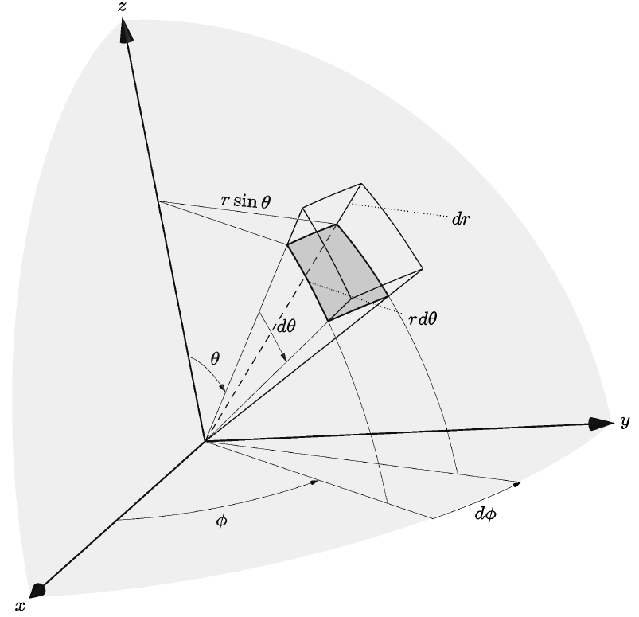
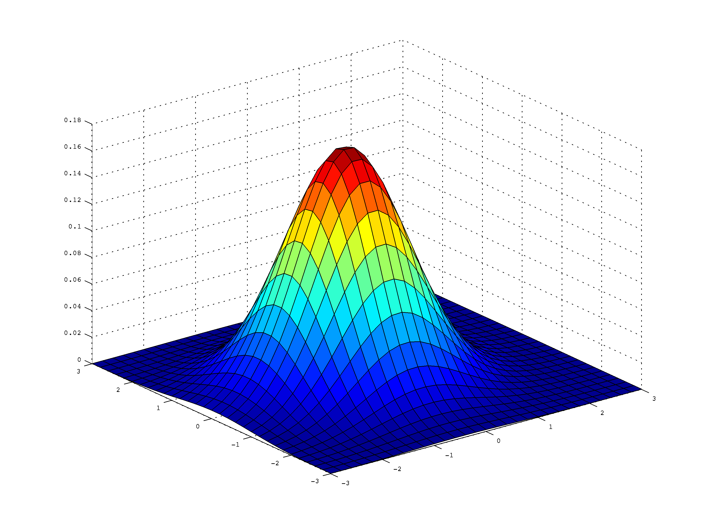

<!-- _class: "title" -->

# Reference **Guide** to MarpX <br> or How to use **MarpX** special tags

## Paulo Cunha - 2025

###

---

<!-- _class: "toc" -->

<div class="multicolumn"><div>

</div><div>

`Slide items:`

- [Header (YAML)](#4)
- [Tables](#23)
- [Videos](#21)
- [Animations](#35)
- [LaTeX Math](#25)
- [Multicolumns](#19)

`Box types:`

- [Boxes](#13)
- [Notes](#37)
- [Callouts](#31)
- [Containers](#39)
</div><div>

</div><div>

`Slide types:`

- [Title Slide](#7)
- [Academic Title](#5)
- [TOC Slide](#9)
- [Transition Slide](#11)
- [One Image Slide](#17)
- [Quote Slide](#29)
- [Black and White Slide](#35)
- [References Slide ](#33)

</div></div>

---

<style scoped>

section table {
  letter-spacing: 0.0015rem;
  line-height: .8;

  --marpx-table-font-size: 14pt;
  --marpx-table-hover-background-color: #ecf8ffff;
  --marpx-table-font-family: "Fira Sans Condensed", arial, sans-serif;
}

</style>


# MarpX Features Table

<center>

| Item                                                                               | Marcador                                                             |
| ---------------------------------------------------------------------------------- | -------------------------------------------------------------------- |
| [Boxes](https://cunhapaulo.github.io/marpx/examples/howto.html#13)                 | `<box></box>` or `<span class="box"></span>`                         |
| [Black or White Slides](https://cunhapaulo.github.io/marpx/examples/howto.html#35) | `<!-- _class: "black-slide" -->` or `<!-- _class: "white-slide" -->` |
| [Callouts](https://cunhapaulo.github.io/marpx/examples/howto.html#31)              | `<div class="callout"></div>`                                        |
| [Containers](https://cunhapaulo.github.io/marpx/examples/howto.html#39)            | `<div class="container"></div>`                                      |
| [Multicolumn](https://cunhapaulo.github.io/marpx/examples/howto.html#19)           | `<div class="multicolumn" align="center"></div>`                     |
| [Notes](https://cunhapaulo.github.io/marpx/examples/howto.html#37)                 | `<div class="notes"></div>`                                          |
| [Quotes](https://cunhapaulo.github.io/marpx/examples/howto.html#29)                | `<!-- _class: "quote" -->` or `<!-- _class: "quote dark" -->`        |
| [References](https://cunhapaulo.github.io/marpx/examples/howto.html#33)            | `<!-- _class: "references" -->`                                      |
| [Title](https://cunhapaulo.github.io/marpx/examples/howto.html#5)                  | `<!-- _class: "title" -->` or `<!-- _class: "title-academic" -->`    |
| [TOC](https://cunhapaulo.github.io/marpx/examples/howto.html#9)                    | `<!-- _class: "toc" -->`                                             |
| [Transition Slide](https://cunhapaulo.github.io/marpx/examples/howto.html#11)      | `<!-- _class: "chapter" -->`                                         |
| [Videos](https://cunhapaulo.github.io/marpx/examples/howto.html#21)                | `<video controls height="400px"></video>`                            |

<tabcaption>Table of MarpX functionalities.

---


<!-- _class: "black-slide nobrand"  -->

# The YAML Header is at the top of your Markdown file

```YAML
---
title: How to use MarpX Special Tags
author: Paulo Cunha
description: Canonical use of marpx theme
keywords: [Marp, MarpX, Gödel, Paulo Cunha]

header: 2025
footer: "[Back to the Index](#2)"

marp: true
theme: gödel
paginate: true
transition: none

size: 16:9
lang: en
math: mathjax
---
```

---

<!-- _class: "title-academic" -->
<!-- _backgroundColor: white  -->


<div class="title"         > Über formal unentscheidbare Sätze der Principia Mathematica und verwandter Systeme </div>
<div class="subtitle"      > On Formally Undecidable Propositions </div>
<div class="author"        > Kurt Gödel </div>
<div class="date"          > Königsberg, 5–7 September, 1930 </div>
<div class="organization"  > Second Conference on the Epistemology of the Exact Sciences </div>

---

<!-- _class: "black-slide" -->

# \<!-- \_class: "title-academic" -->

```md
---

<!-- _class: "title-academic" -->
<!-- _backgroundColor: white  -->


<div class="title"       >  Über formal unentscheidbare 
                           Sätze der Principia Mathematica und verwandter Systeme </div>
<div class="subtitle"    >  On Formally Undecidable Propositions </div>
<div class="author"      >  Kurt Gödel </div>
<div class="date"        >  Königsberg, 5–7 September, 1930 </div>
<div class="organization">  Second Conference on the Epistemology of the Exact Sciences </div>

---
```

---

<!-- _class: "title" -->

# Über formal unentscheidbare Sätze der Principia Mathematica und verwandter Systeme

## On Formally Undecidable Propositions

---

<!-- _class: "black-slide" -->

# \<!-- \_class: "title" -->

```md
<!-- _class: "title" -->

# Über formal unentscheidbare Sätze der Principia Mathematica und verwandter Systeme

## On Formally Undecidable Propositions
```

---

<!-- _class: "toc" -->

0. [Title]()
1. [Transition Slide]()
2. [Normal Slide]()
3. [Headers]()
4. [Images]()
5. [Animations and Videos](#35)

---

<!-- _class: "black-slide" -->

# \<!-- \_class: "toc" -->

```md
<!-- _class: "toc" -->

0. [Title](#1)
1. [Transition Slide](#4)
2. [Normal Slide](#5)
3. [Headers](#6)
4. [Images](#7)
5. [Animations and Videos](#15)
```

---

<!-- _class: "chapter" -->

# Transition Slide

## Aditional Text about what´s ahead

---

<!-- _class: "black-slide" -->

# \<!-- \_class: "chapter" -->

```YAML
<!-- _class: "chapter" -->

# Transition Slide

## Aditional Text about what´s ahead

```

---

# Boxes

- Flow of <span class="box">**activities**</span> that use **resources**.

<center>

<span class="box">Input</span> $\longrightarrow$ <span class="box">Process</span> $\longrightarrow$ <span class="box">Output</span>

Another way:

<box>Input Data</box> $\longrightarrow$ <box>Processing</box> $\longrightarrow$ <box>Output info</box>

</center>

---

<!-- _class: black-slide nobrand-->

# \<box> or \<span class="box">

```md
# Boxes

- Flow of <span class="box">**activities**</span> that use **resources**.

<center>

<span class="box">Input</span>
$\longrightarrow$
<span class="box border">Process</span> $
\longrightarrow$
<span class="box">Output</span>

Another way:

<box>Input</box> $\longrightarrow$
<box>Process</box> $\longrightarrow$
<box>Output</box>

</center>
```

---

# Boxes

<center>

<box>

<bbox>Input Data</bbox> $\longrightarrow$ <bbox>Processing</bbox> $\longrightarrow$ <bbox>Output Info</bbox>

</box>

</center>

---

<!-- _class: "black-slide" -->

# \<box> or \<span class="box">

```md
# Boxes

<center>

<box>

<bbox>Input Data</bbox> $\longrightarrow$ <bbox>Processing</bbox> $\longrightarrow$ <bbox>Output Info</bbox>

</box>

</center>
```

---

<!-- _class: "white-slide" -->

# One image slide



<figcaption>Object defined in terms of spherical coordinates.</figcaption>

---

<!-- _class: "black-slide" -->

# \<!-- \_class: "white-slide" -->

```md
<!-- _class: "white-slide" -->

# One image slide


<figcaption>Object defined in terms of spherical coordinates.</figcaption>
or
<br><span class="figcaption">Object defined in terms of spherical coordinates.</span>
```

---

# Images fit into columns

<div class="multicolumn" align="center"><div>

[](https://amzn.eu/d/fQDOCSF)

<figcaption>Sophokles, Suhrkamp (2015).</figcaption>

</div><div>

[](https://amzn.eu/d/bxExVnT)

<figcaption>Göthe, Suhrkamp (2011).</figcaption>

</div><div>

[](https://amzn.eu/d/f3z3qfe)

<figcaption>Heine, Suhrkamp (2011).</figcaption>

</div></div>

---

<!-- _class: black-slide nobrand--->

# \<div class="multicolumn" align="center"><div>

```md
# Images fit into columns

<div class="multicolumn" align="center"><div>

[![h:350px drop-shadow:4px,5px,15px,#010101]
(./assets/images/books/book004.jpg)](https://amzn.eu/d/fQDOCSF)

<figcaption>Sophokles, Suhrkamp (2015).</figcaption>

</div><div>

[![h:350px drop-shadow:4px,5px,15px,#010101]
(./assets/images/books/book003.jpg)](https://amzn.eu/d/bxExVnT)

<figcaption>Göthe, Suhrkamp (2011).</figcaption>

</div><div>

[![h:350px drop-shadow:4px,5px,15px,#010101]
(./assets/images/books/book006.jpg)](https://amzn.eu/d/f3z3qfe)

<figcaption>Heine, Suhrkamp (2011).</figcaption>

</div></div>
```

---

<!-- _class: "white-slide" -->
<!-- _footer: Vídeo de Nikolay Sobolev no Pexels: https://www.pexels.com/pt-br/video/ar-aviao-aeronave-aeroporto-16127349/ -->

# Video

<center>

<video controls height="400px">
  <source src="https://cunhapaulo.github.io/marpx/videos/sample01.mp4">
</video>

<figcaption>Video playing in Marp available only in html export.

</center>

---

<!-- _class: black-slide --->

# \<video controls height="400px">\</video>

```md
<!-- _class: "white-slide" -->
<!-- _footer: Vídeo de Nikolay -->

# Video

<center>

<video controls height="400px">
  <source src="https://cunhapaulo.github.io/marpx/videos/sample01.mp4">
</video>

<figcaption>Video playing in Marp available only in html export.

</center>
```

---

# Renaissance painters

<center>

| Painter           | Country | Birth Year | Death Year | Most Famous Work           |
| ----------------- | :-----: | :--------: | :--------: | -------------------------- |
| Albrecht Dürer    | Germany |    1471    |    1528    | _Melencolia I_             |
| Leonardo da Vinci |  Italy  |    1452    |    1519    | _Mona Lisa_                |
| Michelangelo      |  Italy  |    1475    |    1564    | _Sistine Chapel Ceiling_   |
| Raphael           |  Italy  |    1483    |    1520    | _The School of Athens_     |
| Titian            |  Italy  |   ~1488    |    1576    | _Assumption of the Virgin_ |

<tabcaption>Renowned Renaissance painters with biographical data and masterpieces (alphabetical order).</tabcaption>

<center>

---

<!-- _class: black-slide --->

# Markdown Tables

```md
# Renaissance painters

<center>

| Painter           | Country | Birth Year | Death Year | Most Famous Work           |
| ----------------- | :-----: | :--------: | :--------: | -------------------------- |
| Albrecht Dürer    | Germany |    1471    |    1528    | _Melencolia I_             |
| Leonardo da Vinci |  Italy  |    1452    |    1519    | _Mona Lisa_                |
| Michelangelo      |  Italy  |    1475    |    1564    | _Sistine Chapel Ceiling_   |
| Raphael           |  Italy  |    1483    |    1520    | _The School of Athens_     |
| Titian            |  Italy  |   ~1488    |    1576    | _Assumption of the Virgin_ |

<tabcaption>Renowned Renaissance painters with biographical data and masterpieces
(alphabetical order).</tabcaption>

<center>
```

---

<!-- _class: "white-slide" -->

# Probability Distribution (1)

<div class="multicolumn vcenter"><div>

$$
f(x) = \frac{1}{\sigma \sqrt{2\pi}} \exp\left( -\frac{(x - \mu)^2}{2\sigma^2} \right)
$$

<figcaption>Normal Distribution (Gaussian).</figcaption>

</div><div>



<figcaption>Multivariate Normal Distribution.</figcaption>

</div></div>

---

<!-- _class: black-slide nobrand--->

# LaTeX

```md
<!-- _class: "white-slide" -->

# Probability Distribution (1)

<div class="multicolumn vcenter"><div>

$$
f(x) = \frac{1}{\sigma \sqrt{2\pi}} \exp\left( -\frac{(x - \mu)^2}{2\sigma^2} \right)
$$

<figcaption>Normal Distribution (Gaussian).</figcaption>

</div><div>


<figcaption>Multivariate Normal Distribution.</figcaption>

</div></div>
```

---

# Electromagnetic Field (Differential form)

Below, in modern vector notation, in _differential form_, are Maxwell's four equations governing the `electromagnetic field`.

$$
\begin{align}
\nabla \cdot \mathbf{E} &= \frac{\rho}{\varepsilon_0}
        &&\text{(Gauss's law)}\\
\nabla \cdot \mathbf{B} &= 0
        &&\text{(No magnetic monopoles)}\\
\nabla \times \mathbf{E} &= -\,\frac{\partial \mathbf{B}}{\partial t}
        &&\text{(Faraday-Lenz law)}\\
\nabla \times \mathbf{B} &= \mu_0 \mathbf{J}
        + \mu_0 \varepsilon_0\,\frac{\partial \mathbf{E}}{\partial t}
        &&\text{(Ampere-Maxwell Law)}
\end{align}
$$

---

<!-- _class: "black-slide nobrand"--->

# LaTeX

```latex
# Electromagnetic Field (Differential form)

Below, in modern vector notation, in _differential form_,
are Maxwell's four equations governing the `electromagnetic field`.

$$
\begin{align}
\nabla \cdot \mathbf{E} &= \frac{\rho}{\varepsilon_0}
        &&\text{(Gauss's law)}\\
\nabla \cdot \mathbf{B} &= 0
        &&\text{(No magnetic monopoles)}\\
\nabla \times \mathbf{E} &= -\,\frac{\partial \mathbf{B}}{\partial t}
        &&\text{(Faraday-Lenz law)}\\
\nabla \times \mathbf{B} &= \mu_0 \mathbf{J}
        + \mu_0 \varepsilon_0\,\frac{\partial \mathbf{E}}{\partial t}
        &&\text{(Ampere-Maxwell Law)}
\end{align}
$$

```

---

<!-- _class: "quote dark" -->

"There is an **increasing** demand of current information systems to incorporate the use of a higher degree of formalism in the development process. **Formal Methods** consist of a set of tools and techniques based on mathematical model and formal logic that are used to **specify and verify** requirements and designs for hardware and software systems."

---

<!-- _class: black-slide nobrand--->

# \<!-- \_class: "quote dark" -->

```md
<!-- _class: "quote dark" -->

"There is an **increasing** demand of current information
systems to incorporate the use of a higher degree of formalism
in the development process. **Formal Methods** consist of a set
of tools and techniques based on mathematical model and formal
logic that are used to **specify and verify** requirements and
designs for hardware and software systems."
```

---


# Callouts

<div class="multicolumn">

  <div class="callout info">

# Info

Text for information with <br> **Markdown** formatting.

  </div>

```md
<div class="callout">

# Info

Text for information with <br> **Markdown** formatting.

</div>
```

  </div>

<div class="multicolumn">

  <div class="callout danger">

# Danger

Another text with <br> **Markdown** formatting.

  </div>

```md
<div class="callout danger">

# Danger

Another text with <br> **Markdown** formatting.

</div>
```

</div>

---

# Callouts types

<div class="multicolumn">

  <div class="callout success">

# Success

You may use in semantics.

  </div>

  <div class="callout abstract">

# Abstract

You may use in semantics.

  </div>

  <div class="callout tip">

# Tip

You may use in semantics.

  </div>
  
  <div class="callout todo">

# ToDo

You may use in semantics.

  </div>

</div>

<div class="multicolumn">

  <div class="callout note">

# Note

You may use in semantics.

  </div>

  <div class="callout example">

# Example

You may use in semantics.

  </div>
  
  <div class="callout quote">

# Quote

You may use in semantics.

  </div>

  <div class="callout question">

# Question

You may use in semantics.

  </div>

</div>

<div class="multicolumn">

  <div class="callout warning">

# Warning

You may use in semantics.

  </div>

  <div class="callout failure">

# Failure

You may use in semantics.

  </div>

  <div class="callout danger">

# Danger

You may use in semantics.

  </div>

  <div class="callout bug">

# Bug

You may use in semantics.

  </div>

</div>

---

<!-- _class: "references" -->

# References

<div class="multicolumn"><div>

1. AMERIKS, Karl; HÖFFE, Otfried. **Kant’s Moral and Legal Philosophy**. tradução: Nicholas Walker. Cambridge, Massachusetts: Cambridge University Press, 2009-. ISSN 1878-6847.(The German Philosophical Tradition).
2. ARISTOTELES. **Nikomachische Ethik**. Berlin: Akademie Verlag, 2010. (Klassiker Auslegen).v. 2
3. CASSIRER, Ernst. **The Myth of the State**. New Haven, USA: Yale University Press, 1946.
4. EPSTEIN, Richard L.; CARNIELLI, Walter A. **Computability: Computable Functions, Logic, and the Foundations of Mathematics**. 3. ed. Socorro, New Mexico, USA: Advanced Reasoning Forum, 2008.
5. GADAMER, Hans-Georg. **Wahrheit und Methode**. Berlin: Akademie Verlag, 2007. v. 30.
6. HEGEL, Georg Friederich Wilhelm. **Hegel´s Phenomenology of Spirit**. Tradução: A. V. Miller. New York: Oxford University Press, 2004.

</div><div>

7. HEIDEGGER, Martin. **Sein und Zeit**. 11. ed. Tübingen: Max Niemeyer Verlag, 1967.
8. HUSSERL, Edmund. **The Crisis of European Sciences and Transcendental Phenomenology**. Evanston, USA: Northwestern University Press, 1970.
9. KANT, Immanuel. **Kritik der Praktischen Vernunft**. Berlin: Akademie Verlag, 2002. (Klassiker Auslegen).v. 26
10. KANT, Immanuel. **Groundwork of the Metaphysics of Morals: A German-English Edition**. tradução: Mary Gregor; Jens Timmermann. Cambridge, UK: Cambridge University Press, 2011.
11. KARDEC, Allan. **Das Buch der Geister**. Übersetzung: Edith Burkhard. 3. ed. Brasília, DF: Internationaler Spiritistischer Rat, 2011.
12. PLATO. **Plato Republic**. Tradução: C. D. C. Reeve. Indianapolis, IN, USA: Hackett Publishing Company, 2004.

</div></div>

---

<!-- _class: black-slide nobrand--->

# \<!-- \_class: "references" -->

```md
<!-- _class: "references" -->

# References

<div class="multicolumn"><div>

1. AMERIKS, Karl; HÖFFE, Otfried. **Kant’s Moral and Legal
   Philosophy**. tradução: Nicholas Walker. Cambridge, Massachusetts:
   Cambridge University Press, 2009-. ISSN 1878-6847.(The German Philosophical Tradition).
2. ARISTOTELES. **Nikomachische Ethik**. Berlin: Akademie Verlag, 2010. (Klassiker Auslegen).v. 2
3. CASSIRER, Ernst. **The Myth of the State**. New Haven, USA: Yale University Press, 1946.

</div><div>

7. HEIDEGGER, Martin. **Sein und Zeit**. 11. ed. Tübingen:
   Max Niemeyer Verlag, 1967.
8. HUSSERL, Edmund. **The Crisis of European Sciences and
   Transcendental Phenomenology**. Evanston, USA: Northwestern University Press, 1970.
9. KANT, Immanuel. **Kritik der Praktischen Vernunft**.
   Berlin: Akademie Verlag, 2002. (Klassiker Auslegen).v. 26

</div></div>
```

---

<!-- _class: "black-slide" -->

# Animations &nbsp;<span style="font-size:0.5em;  color:yellow;">(works in HTML only)</span>

<div class="multicolumn vcenter"><div align="center">


<figcaption> First animation.</figcaption>

</div><div align=center>

<iframe src="https://assets.pinterest.com/ext/embed.html?id=77335318596012123" height="380" width="400" frameborder="0" scrolling="no" ></iframe>
<p>
<figcaption> Second animation.</figcaption>

</div></div>

---

<!-- _class: "black-slide nobrand" -->

# \<!-- \_class: "black-slide" -->

```md
<!-- _class: "black-slide" -->

# Animations &nbsp;<span style="font-size:0.5em; color:yellow;">

(works in HTML only)</span>

<div class="multicolumn vcenter><div align=center">


  <figcaption> Static picture.

</div><div align=center>

  <iframe src="https://<address>/<file>" 
  height="390" width="400" frameborder="0" scrolling="no" ></iframe>
  <figcaption> Animation.

## </div></div>
```

---

# Note Boxes


<div class="multicolumn">

<div class="notes">

### Anotações Numeradas:

1. Primiera Tarefa;
2. Segunda Tarefa;
3. Terceira Tarefa.

</div>

<div class="notes">

### Anotações Itemizadas:

- Primiera Tarefa;
- Segunda Tarefa;
- Terceira Tarefa.

</div>

---

<!-- _class: "black-slide nobrand" -->

# \<div class="notes">

```md
---

# Note Boxes

<div class="notes">

# Anotações Itemizadas:

- Primiera Tarefa;
- Segunda Tarefa;
- Terceira Tarefa.

</div>

---
```

---

# Containers

<div class="container">

## Título

<center>

<box><bbox>Input<br>Data</bbox> $\longrightarrow$ <bbox>Processing</bbox> $\longrightarrow$ <bbox>Output<br>info</bbox></box> $\longrightarrow$ <bbox> Consumer </bbox>

</center>

</div>

---

<!-- _class: "black-slide" -->

# \<div class="container">\</div>

```md
# Containers

<div class="container">

## Título

<center>

<box><bbox>Input<br>Data</bbox>$\longrightarrow$ <bbox>Processing</bbox> $\longrightarrow$ <bbox>Output<br>info</bbox></box> $\longrightarrow$ <bbox> Consumer </bbox>

</center>

</div>
```

---

# Containers

<div class="container">

## Título

<center>

<bbox><box>Input<br>Data</box> $\longrightarrow$ <box>Processing</box> $\longrightarrow$<box>Output<br>info</box></bbox> $\longrightarrow$ <box> Consumer </box>

</center>

</div>

---

<!-- _class: "blank" -->

<center>

## <!-- fit --> [`Return to beginning`](#2) <br>  or <br> [`Go to MarpX at Github`](https://github.com/cunhapaulo/MarpX)

</center>


