<!-- _class: title -->

#  This is the Slidedeck Title in class `title`
## This is Subtitle in class  `title`

---
<!-- _class: blank -->

<div class="vcenter">


</div>

---
<!-- _class: agenda  -->

---
<!-- _class: chapter -->

# Transition Slide
## Aditional Text about what´s  ahead

---
# Is Algebraic Graph Knowledge a **Possibility**?

`Research` has been conducted in order to evaluate the possibility of reaching meaningful knowledge from Algebraic Graph transformations.

- Model Cheking and theorem prooving are viable paths.

When the neet to make strong assertions becomes inevitable:

- This is the first way: outstanding assertion!

<footnote>
* Note: This is a very long footnote line intended to test the layout of two.

</footnote>

---
<!-- _class: multicolumn -->

<div>

# H1 - H1 level of header
## H2 - H2 level of header
### H3 - H3 level of header
#### H4 - H4 level of header
##### H5 - H5 level of header
###### H6 - H6 level of header

</div><div>

- This is a fragment o normal text written here in order to exemplify the use of several featrues in CSS.

- This is a fragment o normal text written here in order to exemplify the use of several featrues in CSS.

    - This is one **bold** comment.
    - This is another *italic* comment.

</div></div>

---
# One image slide


<figcaption>Object defined in terms of spherical coordinates.</figcaption>

---
# Images fit into columns

<div class="multicolumn" align="center"><div>

[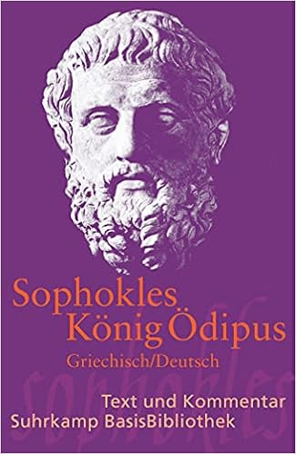](https://amzn.eu/d/fQDOCSF)
<figcaption>Sophokles, Suhrkamp (2015).</figcaption>

</div><div>

[](https://amzn.eu/d/bxExVnT)
<figcaption>Göthe, Suhrkamp (2011).</figcaption>

</div><div>

[](https://amzn.eu/d/f3z3qfe)
<figcaption>Heine, Suhrkamp (2011).</figcaption>

</div></div>

---
# Image and text on the same slide (1)

<div class="multicolumn vcenter"><div>

[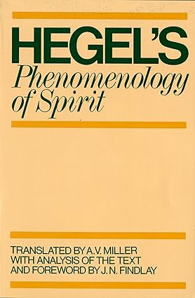](https://a.co/d/c1lqFtF)
<figcaption align="center"> <i>Phänomenologie des Geistes</i> Oxford edition.</figcaption>

</div><div>

## Hegels Phänomenologie
Das Buch trug ursprünglich den Titel "Phänomenologie des Geistes" von seinem Autor: G.W.F. Hegel.

- Das 1807 veröffentlichte Werk markiert eine bedeutende Entwicklung des deutschen Idealismus nach Kant.
- In diesem Buch entwickelt Hegel seine Konzepte der Dialektik.

> Price at Amazon used to be $ 17.83.

</div>
</div>

---
# Image and text on the same slide (2)

<div class="multicolumn vcenter"><div>

## Kant, Leibniz & Newton

Philosophy and the sciences were closely linked in the age of Leibniz, Newton, and Kant.

This addresses the transformations of metaphysics as a discipline, the emergence of analytical mechanics, the diverging avenues of 18th-century Newtonianism, the body-mind problem, and philosophical principles of classification in the life sciences.

> Price at Amazon used to be 128,39 €

</div><div>

[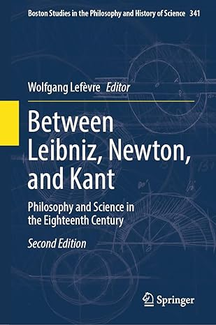](https://amzn.eu/d/9zaa7UK)
<figcaption align="center">Springer edition (2023).</figcaption>

</div></div>

---
# Multi-images  Environment (1)

<div class="multicolumn" align="center">

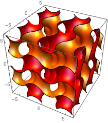
<span class="figcaption">Math001.</span>

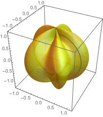
<span class="figcaption">Math002.</span>

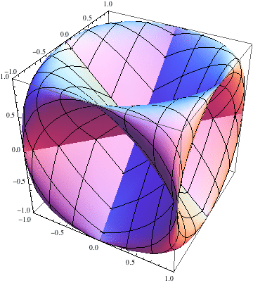
<span class="figcaption">Math003.</span>

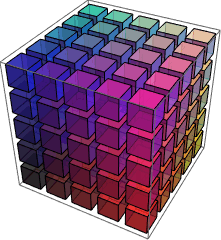
<span class="figcaption">Math004.</span>

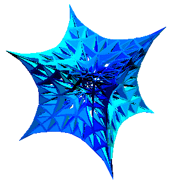
<span class="figcaption">Math005.</span>

</div>

---
# Multi-images  Environment (2)

<div class="multicolumn" align="center">

<div>

  
  <span class="figcaption">Math001.</span>

  
  <span class="figcaption">Math002.</span>

</div>


<span class="figcaption">Math003.</span>

<div>

  
  <span class="figcaption">Math004.</span>

  
  <span class="figcaption">Math005.</span>

</div></div>

---
# Figures and caption in *multicolumn*

<div class="multicolumn" align="center">

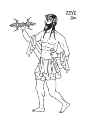
<span class="figcaption">God Zeus</span>

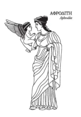
<span class="figcaption">Afrodite</span>

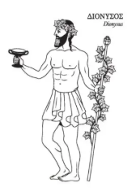
<span class="figcaption">Dionísio</span>

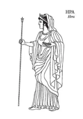
<span class="figcaption">Era</span>

</div>

---
# *Ordered* and *unordered* lists 

<div class="multicolumn"><div>

1. First object in list;
2. Second object in list;
3. Third object in list;
   1. First objetc in sublist;
   2. Second object in sublist;
      1. Another level;
      2. Yet another item.
   3. Third object in sublist.
4. Fourth object in List.

</div><div>

- First object in list;
- Second object in list;
- Third object in list;
   - First objetc in sublist;
   - Second object in sublist;
      - Another level;
      - Yet another item.   
   - Third object in sublist;
- Fourth object in List;

</div></div>

---

<!-- _class: chapter -->

# Tables
## Organizing data with tables in Markdown

---

# Renaissance painters
<center>

| Painter           | Country | Birth Year | Death Year | Most Famous Work           |
| ----------------- | :-----: | :--------: | :--------: | -------------------------- |
| Albrecht Dürer    | Germany |    1471    |    1528    | *Melencolia I*             |
| Leonardo da Vinci |  Italy  |    1452    |    1519    | *Mona Lisa*                |
| Michelangelo      |  Italy  |    1475    |    1564    | *Sistine Chapel Ceiling*   |
| Raphael           |  Italy  |    1483    |    1520    | *The School of Athens*     |
| Titian            |  Italy  |   ~1488    |    1576    | *Assumption of the Virgin* |

<tabcaption>Renowned Renaissance painters with biographical data and masterpieces (alphabetical order).</tabcaption>
<center>

---
# Programming languages

<center>

| Language | Creator(s)          | Year | Main Paradigm(s)                            |
| -------- | ------------------- | ---- | ------------------------------------------- |
| C        | _Dennis Ritchie_    | 1972 | Structured, Procedural                      |
| C++      | _Bjarne Stroustrup_ | 1983 | Object-oriented, multi-paradigm             |
| Erlang   | _Joe Armstrong_     | 1986 | Funcional, Concorrente                      |
| Haskell  | _Comitê Haskell_    | 1990 | Purely Functional                           |
| Java     | _James Gosling_     | 1995 | Object-Oriented                             |
| Pascal   | _Niklaus Wirth_     | 1970 | Structured, Procedural                      |
| Python   | _Guido van Rossum_  | 1991 | Multi-paradigm (OO, Procedural, Functional) |

<tabcaption>List of programming languages.</tabcaption>
</center>

---

<!-- _class: chapter -->

# Mathematical Formulations 
## Writing equations with LaTeX

---
# Probability Distribution (1)

<div class="multicolumn vcenter"><div>

$$
f(x) = \frac{1}{\sigma \sqrt{2\pi}} \exp\left( -\frac{(x - \mu)^2}{2\sigma^2} \right)
$$
<figcaption>Normal Distribution (Gaussian).</figcaption>

</div><div>


<figcaption>Multivariate Normal Distribution.</figcaption>

</div></div>

---
# Probability Distribution (2)

<div class="multicolumn vcenter"><div>

$$
f(x) = \frac{\sqrt{\frac{(d_1 x)^{d_1} d_2^{d_2}}{(d_1 x + d_2)^{d_1 + d_2}}}}{x \, B\left(\frac{d_1}{2}, \frac{d_2}{2}\right)}
$$
<figcaption>Fisher-Snedecor F distribution.</figcaption>

</div><div>

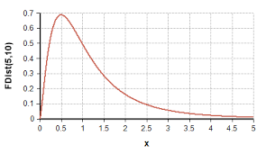
<figcaption>Multivariate Normal Distribution.</figcaption>

</div></div>

---
# Electromagnetic Field (Differential form)

Below, in modern vector notation, in *differential form*, are Maxwell's four equations governing the `electromagnetic field`.

$$
\begin{align}
\nabla \cdot \mathbf{E} &= \frac{\rho}{\varepsilon_0} 
        &&\text{(Gauss's law)}\\
\nabla \cdot \mathbf{B} &= 0
        &&\text{(No magnetic monopoles)}\\
\nabla \times \mathbf{E} &= -\,\frac{\partial \mathbf{B}}{\partial t}
        &&\text{(Faraday-Lenz law)}\\
\nabla \times \mathbf{B} &= \mu_0 \mathbf{J} 
        + \mu_0 \varepsilon_0\,\frac{\partial \mathbf{E}}{\partial t}
        &&\text{(Ampere-Maxwell Law)}
\end{align}
$$

---
# Electromagnetic Field (Integral form)

Below, in modern vector notation, in *integral form*, are Maxwell's four equations governing the electromagnetic field.

$$
\begin{align}
\oint_{\Sigma} \mathbf{E}\cdot d\mathbf{S}
      &= \frac{Q_{\text{enc}}}{\varepsilon_0}
        &\text{(Gauss's law)}\\
\oint_{\Sigma} \mathbf{B}\cdot d\mathbf{S}
      &= 0
        &\text{(No magnetic monopoles)}\\
\oint_{\partial\Sigma} \mathbf{E}\cdot d\mathbf{l}
      &= -\,\frac{d}{dt}\int_{\Sigma}\mathbf{B}\cdot d\mathbf{S}
        &\text{(Faraday-Lenz law)}\\
\oint_{\partial\Sigma} \mathbf{B}\cdot d\mathbf{l}
      &= \mu_0 I_{\text{enc}}
      + \mu_0 \varepsilon_0\,\frac{d}{dt}
        \int_{\Sigma}\mathbf{E}\cdot d\mathbf{S}
        &\text{(Ampere-Maxwell Law)}
\end{align}
$$

---
<!-- _class: nobrand -->

# Python programs

<div class="multicolumn"><div>

```python
"""
O programa traça, em 2D, os perfis instantâneos do
campo elétrico E (y) e do campo magnético B (z), 
ambos perpendiculares ao eixo de propagação x.
"""
import numpy as np
import matplotlib.pyplot as plt

# Constantes e parâmetros
c = 3e8
E0 = 1.0
lambda_ = 1.0
k = 2 * np.pi / lambda_
omega = 2 * np.pi * c / lambda_
x = np.linspace(0, 2 * lambda_, 1000)
t = 0
E = E0 * np.sin(k * x - omega * t)
B = (E0 / c) * np.sin(k * x - omega * t)
B_scaled = c * B  # para visualização

plt.plot(x, E, label='E(x, t=0)')
plt.plot(x, B_scaled, label='c·B(x, t=0)')
plt.xlabel('x (m)')
plt.ylabel('Amplitude (u.a.)')
plt.title('Propagação de onda eletromagnética no vácuo (instantâneo)')
plt.legend()
plt.grid(True)
plt.show()
```
<figcaption> First program.</figcaption>

</div><div>

```python
import numpy as np
import matplotlib.pyplot as plt
from mpl_toolkits.mplot3d import Axes3D   # registra o proj. 3-D

# --------------------- parâmetros físicos ----------------------
c   = 3.0e8                      # velocidade da luz (m s⁻¹)
E0  = 1.0                        # amplitude arbitrária do campo elétrico (V m⁻¹)
lam = 1.0                        # comprimento de onda (m)
k = 2*np.pi/lam                  # número de onda
ω = 2*np.pi*c/lam                # frequência angular
# domínios espacial e temporal
x = np.linspace(0, 2*lam, 1000)  # duas ondas completas
t = 0.0                          # instante “congelado”
# --------------------- campos E e B ----------------------------
E =  E0 * np.sin(k*x - ω*t)      # componente em y
B = (E0/c) * np.sin(k*x - ω*t)   # componente em z (antes do escalonamento)
B_plot = c * B                   # escala-se por c para comparar a E
# --------------------- figura 3-D ------------------------------
fig = plt.figure(figsize=(8, 4))
ax  = fig.add_subplot(111, projection='3d')

# linha do campo elétrico: (x, E, 0)
ax.plot(x, E, np.zeros_like(x), label='E(x, t=0)')
# linha do campo magnético escalonado: (x, 0, c B)
ax.plot(x, np.zeros_like(x), B_plot, label='c·B(x, t=0)')
# rótulos e estética
ax.set_xlabel('x (m)')
ax.set_ylabel('E (V/m)')
ax.set_zlabel('c·B (V/m)')
ax.set_title('Propagação de uma onda eletromagnética no vácuo (instantâneo 3-D)')
ax.legend()
plt.tight_layout()
plt.show()
```
<figcaption> Second program.</figcaption>

</div></div>

---
<!-- _class: nobrand -->

# Electromagnetic wave propagation (1)

[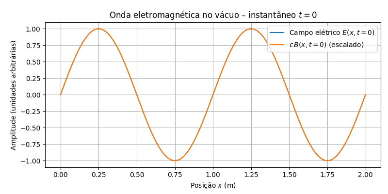](./programs/eletromag-plot01.py)
<figcaption>Result of the 3D rendering of the program electromag-plot01.py.</figcaption>

---
<!-- _class: nobrand -->

# Electromagnetic wave propagation (2)

[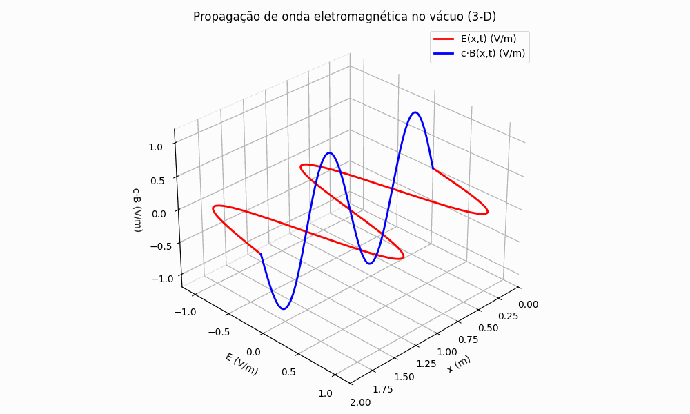](./programs/eletromag-plot04-animate.py)
<figcaption>3D animation of an electromagnetic wave propagation.</figcaption>

---

<!-- _class: chapter -->

# Quotes
## Special text deserves special space

---

<!-- _class: quote -->

"There is an **increasing** demand of current information systems to incorporate the use of a higher degree of formalism in the development process. **Formal Methods** consist of a set of tools and techniques based on mathematical model and formal logic that are used to **specify and verify** requirements and designs for hardware and software systems."

---

<!-- _class: quote dark -->

"There is an **increasing** demand of current information systems to incorporate the use of a higher degree of formalism in the development process. **Formal Methods** consist of a set of tools and techniques based on mathematical model and formal logic that are used to **specify and verify** requirements and designs for hardware and software systems."

---

<!-- class: "chapter" -->

# Appendix
## Bibliography, References, Appendix. etc.

---

<!-- class: references -->


# Appendix 1 - Special Sections (1)

<center>

 | CSS Section         | Description/Purpose         | Markdown Class (example)       |
 | ------------------- | --------------------------- | :----------------------------- |
 | section             | Default slide               | `<!-- _class: section -->`     |
 | section.title       | Title slide                 | `<!-- _class: title -->`       |
 | section.title-bg    | Title slide with background | `<!-- _class: title-bg -->`    |
 | section.chapter     | Chapter slide               | `<!-- _class: chapter -->`     |
 | section.chapter-alt | Alternative chapter         | `<!-- _class: chapter-alt -->` |
 | section.agenda      | Agenda/content slide        | `<!-- _class: agenda -->`      |
 | section.end         | Thank you slide             | `<!-- _class: end -->`         |
 | section.end-bg      | Thank you with background   | `<!-- _class: end-bg -->`      |
 | section.totalpages  | Slide showing total pages   | `<!-- _class: totalpages -->`  |
 | section.copyright   | Copyright slide             | `<!-- _class: copyright -->`   |
 | section.logos       | Slide with additional logos | `<!-- _class: logos -->`       |

<tabcaption>List of tags used (1).</tabcaption>

</center>

---
# Appendix 1 - Special Sections (2)

<center>

 | CSS Section                 | Description/Purpose                             | Markdown Class (example)               |
 | --------------------------- | ----------------------------------------------- | -------------------------------------- |
 | section.blank               | Blank slide                                     | `<!-- _class: blank -->`               |
 | section.nobrand             | Slide without branding                          | `<!-- _class: nobrand -->`             |
 | section.multicolumn         | Slide with multiple columns                     | `<!-- _class: multicolumn -->`         |
 | section.multicolumn vcenter | Vertically centered slide with multiple columns | `<!-- _class: multicolumn vcenter -->` |
 | section.cols                | Slide with flexible columns                     | `<!-- _class: cols -->`                |
 | section.rows                | Slide with flexible rows                        | `<!-- _class: rows -->`                |
 | section.grid-tlr            | Grid: top, left, right                          | `<!-- _class: grid-tlr -->`            |
 | section.grid-lrb            | Grid: left, right, bottom                       | `<!-- _class: grid-lrb -->`            |
 | section.quote               | Quote slide (unified quote)                     | `<!-- _class: quote -->`               |
 | section.quote.dark          | Alternative quote (formerly quote2)             | `<!-- _class: quote dark -->`          |
 | section.references          | References/bibliography slide                   | `<!-- _class: references -->`          |

<tabcaption>List of tags used (2).</tabcaption>

</center>

---
<!-- class: "references" -->

# References 

<div class="multicolumn"><div>

  1. AMERIKS, Karl; HÖFFE, Otfried. **Kant’s Moral and Legal Philosophy**. tradução: Nicholas Walker. Cambridge, Massachusetts: Cambridge University Press, 2009-. ISSN 1878-6847.(The German Philosophical Tradition). 
  2. ARISTOTELES. **Nikomachische Ethik**. Berlin: Akademie Verlag, 2010. (Klassiker Auslegen).v. 2
  3. CASSIRER, Ernst. **The Myth of the State**. New Haven, USA: Yale University Press, 1946.
  4. EPSTEIN, Richard L.; CARNIELLI, Walter A. **Computability: Computable Functions, Logic, and the Foundations of Mathematics**. 3. ed. Socorro, New Mexico, USA: Advanced Reasoning Forum, 2008. 
  5. GADAMER, Hans-Georg. **Wahrheit und Methode**. Berlin: Akademie Verlag, 2007. v. 30.
  6. HEGEL, Georg Friederich Wilhelm. **Hegel´s Phenomenology of Spirit**. Tradução: A. V. Miller. New York: Oxford University Press, 2004.

</div><div>

  7. HEIDEGGER, Martin. **Sein und Zeit**. 11. ed. Tübingen: Max Niemeyer Verlag, 1967. 
  8. HUSSERL, Edmund. **The Crisis of European Sciences and Transcendental Phenomenology**. Evanston, USA: Northwestern University Press, 1970. 
  9. KANT, Immanuel. **Kritik der Praktischen Vernunft**. Berlin: Akademie Verlag, 2002. (Klassiker Auslegen).v. 26 
  10. KANT, Immanuel. **Groundwork of the Metaphysics of Morals: A German-English Edition**. tradução: Mary Gregor; Jens Timmermann. Cambridge, UK: Cambridge University Press, 2011. 
  11. KARDEC, Allan. **Das Buch der Geister**. Übersetzung: Edith Burkhard. 3. ed. Brasília, DF: Internationaler Spiritistischer Rat, 2011. 
  12. PLATO. **Plato Republic**. Tradução: C. D. C. Reeve. Indianapolis, IN, USA: Hackett Publishing Company, 2004. 

</div></div>

---
# Credits


<div class="multicolumn"><div>

  1. Cover image: Flute Player. Courtesy of ©️ nicoolay/DigitalVision Vectors/Getty Images ([HUDAK, Paul. **The Haskell School of Music: From Signals to Symphonies**. 1st ed. New Heaven: Cambridge university Press. 2018](https://a.co/d/hU2R2TM)).
  2. Cover image: Courtesy of ©️ Ishtar Bäcklund Dakhil ([THOR, Annika. **Der Sohn des Odysseus**. Berlin: Verlag Urachhaus 2021.](https://amzn.eu/d/0U57lKN)

</div><div>

  1. Shaun The Sheep ©️ 2025 aardman animations ltd.

</div></div>


